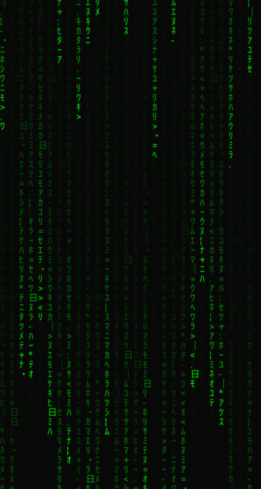

# matrix-effect-js
Matrix movie lettering rain effect using JavaScript 
Tag `<canvas>` is an HTML element which can be used to draw graphics via scripting (usually JavaScript). This can, for instance, be used to draw graphs, combine photos, or create simple (and not so simple) animations

